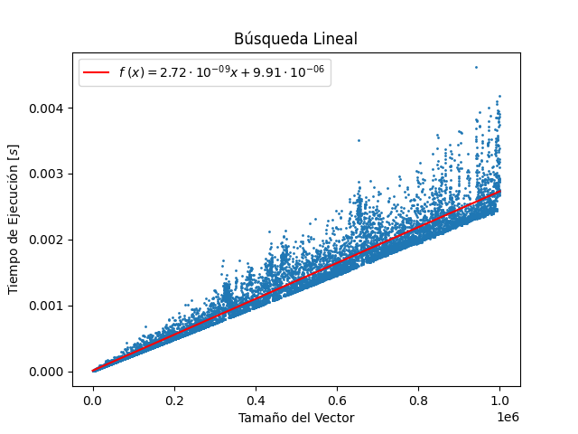
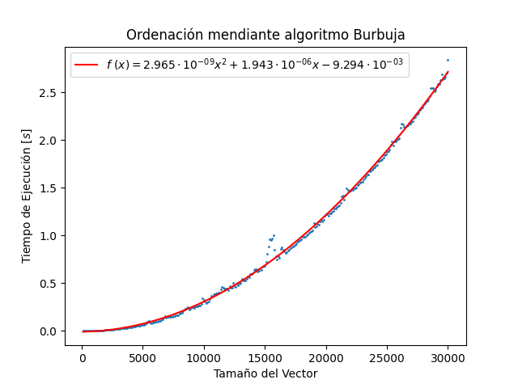
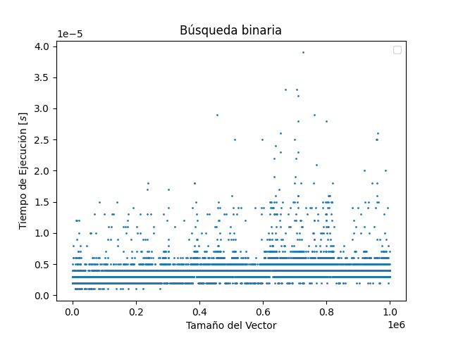
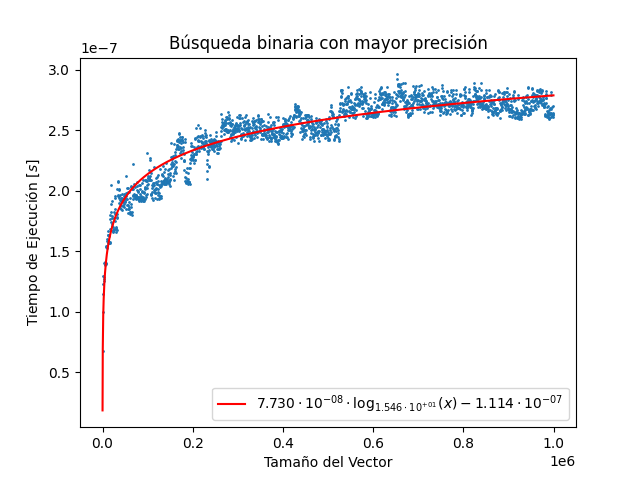
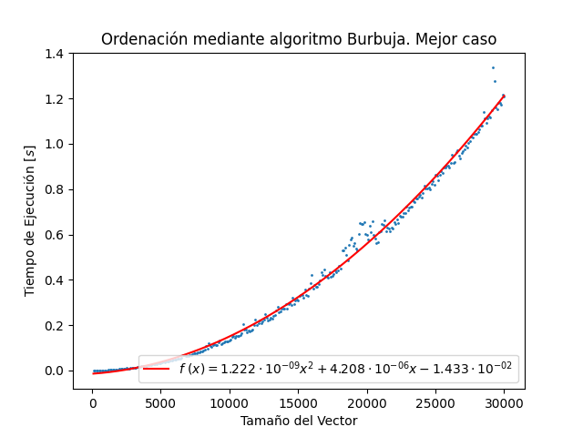
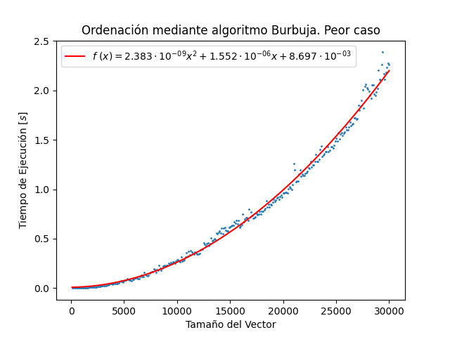
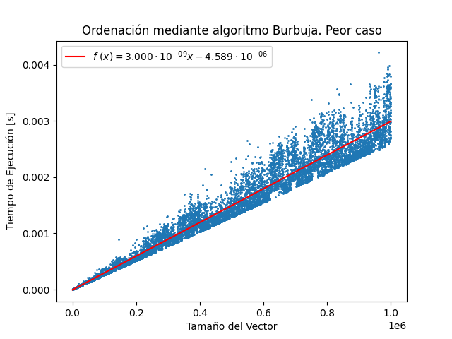

# Práctica 1. Eficiencia

**Autor:** Arturo Olivares Martos
***

- **Asignatura:** Estructura de Datos.
- **Curso Académico:** 2023-24.
- **Grado:** Doble Grado en Ingeniería Informática y Matemáticas.
- **Grupo:** Único.
- **Profesor:** Ignacio Aguilera Martos.
- **Descripción:** Primera práctica sobre eficiencia de algoritmos.

## Ejercicio de Ejemplo.
Consideramos el algoritmo de búsqueda lineal presente en la siguiente función:
```cpp
int buscar(const int *v, int n, int x) {
    int i=0;

    while (i<n && v[i]!=x)
        i=i+1;

    if (i<n)
        return i;
    else
        return -1;
}
```

Calculamos en primer lugar su eficiencia teórica:
$$T(n)=1+4+\left(\sum_{i=0}^{n-1}2+4\right)+1+\max\{1,1\} = 6n+7\in O(n)$$

Para calcular su eficiencia empírica, empleamos el siguiente código:
```cpp
#include <iostream>
#include <ctime>    // Recursos para medir tiempos
#include <cstdlib>  // Para generación de números pseudoaleatorios
using namespace std;


/**
 * @brief Función que implementa la búsqueda lineal en un vector.
 * @param v Vector en el que se realiza la búsqueda.
 * @param n Número de elementos del vector.
 * @param x Elemento buscado.
 * @return El índice del elemento buscado. -1 si la búsqueda falla.
 */
 int buscar(const int *v, int n, int x) {
    int i=0;

    while (i<n && v[i]!=x)
        i=i+1;

    if (i<n)
        return i;
    else
        return -1;
}


void sintaxis() {
    cerr << "Sintaxis:" << endl;
    cerr << "  TAM: Tamaño del vector (>0)" << endl;
    cerr << "  VMAX: Valor máximo (>0)" << endl;
    cerr << "Genera un vector de TAM números aleatorios en [0,VMAX[" << endl;
    exit(EXIT_FAILURE);
}


int main(int argc, char * argv[]) {
    if (argc!=3)               // Lectura de parámetros
        sintaxis();

    int tam=atoi(argv[1]);     // Tamaño del vector
    int vmax=atoi(argv[2]);    // Valor máximo
    if (tam<=0 || vmax<=0)
        sintaxis();


    // Generación del vector aleatorio
    int *v=new int[tam];   //Reserva de memoria
    srand(time(0));        // Inicialización generador números pseudoaleatorios
    for (int i=0; i<tam; i++)  // Recorrer vector
        v[i] = rand() % vmax;    // Generar aleatorio [0,vmax[

    clock_t tini;    // Anotamos el tiempo de inicio
    tini=clock();

    int x = vmax+1;  // Buscamos un valor que no está en el vector
    buscar(v,tam,x); // de esta forma forzamos el peor caso

    clock_t tfin;    // Anotamos el tiempo de finalización
    tfin=clock();

    // Mostramos resultados (Tamaño del vector y tiempo de ejecución en seg.)
    cout << tam << "\t" << (tfin-tini)/(double)CLOCKS_PER_SEC << endl;

    delete [] v;     // Liberamos memoria dinámica
}
```

Para poder ejecutarlo con distintos valores de $n$, hemos empleado el siguiente script:
```bash
#!/bin/bash

inicio=100
fin=30000
incremento=500
archivo_busqueda=$1  # El nombre del archivo se pasa como argumento

if [ -z "$archivo_busqueda" ]; then
    echo "Uso: $0 <nombre_del_archivo_busqueda>"
    exit 1
fi

i=$inicio
echo > tiempos.dat

while [ $i -le $fin ]; do
    echo "Ejecución tam = $i"
    ./"$archivo_busqueda" $i 10000 >> tiempos.dat
    i=$((i + incremento))
done
```

Por tanto, y tras emplear el correspondiente tiempo, hemos representado los datos en el plano. Hemos realizado el ajuste lineal, ya que sabemos que la eficiencia es de orden $O(n)$. Esto lo hemos hecho mediante el siguiente código de Python:

```python
import matplotlib.pyplot as plt
import csv
import numpy as np

# Grado del polinomio de aproximación
n=1
title = "Búsqueda Lineal"

# Listas para almacenar los datos
x = []
y = []

# Leer el archivo CSV y extraer los datos
with open('tiempos.dat', 'r') as csv_file:
    csv_reader = csv.reader(csv_file, delimiter='\t')
    for row in csv_reader:
        if len(row) >= 2:
            x.append(int(row[0]))
            y.append(float(row[1]))

# Crear el gráfico de dispersión con puntos más pequeños (s)
plt.scatter(x, y, s=1)

# Calcular la función de regresión (grado en función de n)
coefficients = np.polyfit(x, y, n)
regression_line = [sum(coefficients[i] * xi ** (n - i) for i in range(n + 1)) for xi in x]

# Formatear la ecuación de la función de regresión en notación científica personalizada
etiqueta = "$f~(x)="
for i in range(n, -1, -1):
    coef_part = f"{coefficients[n-i]:.3e}".split('e')
    etiqueta += f"{coef_part[0]} \\cdot 10^{{{coef_part[1]}}}"

    if (i!=0):
        etiqueta += "x"
        if (i!=1):
            etiqueta+="^{" + str(i) + "}"
        
        if (coefficients[n-i+1]>0):   # Si el siguiente número es negativo, no se añade el signo.
            etiqueta += "+"
etiqueta+= "$"

# Agregar la recta de regresión al gráfico
plt.plot(x, regression_line, color='red', label=etiqueta)


# Configurar etiquetas de los ejes
plt.xlabel('Tamaño del Vector')
plt.ylabel('Tiempo de Ejecución $[s]$')
plt.title(title)

# Mostrar el gráfico con la leyenda
plt.legend()

# Mostrar el gráfico
plt.show()
```

En el caso de la búsqueda lineal, tenemos el siguiente resultado:



## Ejercicio 1 y 2. Ordenación mediante el método de burbuja.
Consideramos el algoritmo de búsqueda lineal presente en la siguiente función:
```cpp
void ordenar(int *v, int n) {
    for (int i=0; i<n-1; i++)
        for (int j=0; j<n-i-1; j++)
            if (v[j]>v[j+1]) {
                int aux = v[j];
                v[j] = v[j+1];
                v[j+1] = aux;
            }
}
```

Calculamos en primer lugar su eficiencia teórica:
$$T(n)=2+\sum_{i=0}^{n-1}\left(2 + 2+\sum_{j=0}^{n-i-1}\left(2+4+11\right)\right)
= 2+4n + 4\cdot 17\cdot \sum_{i=0}^{n-1}(n-i) = 2+4n+68n^2-68\cdot n\cdot \frac{1+n}{2}\in O(n^2)$$

por tanto, tenemos que el algoritmo de ordenación mediante el método de burbuja tiene complejidad $O(n^2)$.

Para calcular su eficiencia empírica, empleamos el siguiente código:
```cpp
#include <iostream>
#include <ctime>    // Recursos para medir tiempos
#include <cstdlib>  // Para generación de números pseudoaleatorios
using namespace std;


/**
 * @brief Función que implementa la ordenación mediante el algoritmo de burbuja en un vector.
 * @param v Vector en el que se realiza la ordenación.
 * @param n Número de elementos del vector.
 */
void ordenar(int *v, int n) {
    for (int i=0; i<n-1; i++)
        for (int j=0; j<n-i-1; j++)
            if (v[j]>v[j+1]) {
                int aux = v[j];
                v[j] = v[j+1];
                v[j+1] = aux;
            }
}

void sintaxis() {
    cerr << "Sintaxis:" << endl;
    cerr << "  TAM: Tamaño del vector (>0)" << endl;
    cerr << "  VMAX: Valor máximo (>0)" << endl;
    cerr << "Genera un vector de TAM números aleatorios en [0,VMAX[" << endl;
    exit(EXIT_FAILURE);
}


int main(int argc, char * argv[]) {
    if (argc!=3)               // Lectura de parámetros
        sintaxis();

    int tam=atoi(argv[1]);     // Tamaño del vector
    int vmax=atoi(argv[2]);    // Valor máximo
    if (tam<=0 || vmax<=0)
        sintaxis();


    // Generación del vector aleatorio
    int *v=new int[tam];   //Reserva de memoria
    srand(time(0));        // Inicialización generador números pseudoaleatorios
    for (int i=0; i<tam; i++)  // Recorrer vector
        v[i] = rand() % vmax;    // Generar aleatorio [0,vmax[

    clock_t tini;    // Anotamos el tiempo de inicio
    tini=clock();

    int x = vmax+1;  // Buscamos un valor que no está en el vector
    buscar(v,tam,x); // de esta forma forzamos el peor caso

    clock_t tfin;    // Anotamos el tiempo de finalización
    tfin=clock();

    // Mostramos resultados (Tamaño del vector y tiempo de ejecución en seg.)
    cout << tam << "\t" << (tfin-tini)/(double)CLOCKS_PER_SEC << endl;

    delete [] v;     // Liberamos memoria dinámica
}
```

Para poder ejecutarlo con distintos valores de $n$ y representarlo hemos empleado códigos similares a los del caso anterior. Por tanto, en el caso de la ordenación mediante el algorimo de burbuja, tenemos:



## Ejercicio 3. Problemas de Precisión. Búsqueda Binaria.
Consideramos el algoritmo de búsqueda binaria que se describe en la siguiente función, proporcionada en el enunciado, en el cual se pide que se adivine cuál es su función:
```cpp
int operacion(int *v, int n, int x, int inf, int sup) {
    int med;
    bool enc = false;
    while ((inf < sup) && (!enc)) {
        med = (inf + sup) / 2;
        if (v[med] == x)
            enc = true;
        else if (v[med] < x)
            inf = med + 1;
        else
            sup = med - 1;
    }
    if (enc)
        return med;
    else
        return -1;
}
```

Tenemos que su eficiencia teórica es $O(\log_2(n))$.

Para calcular su eficiencia empírica, empleamos el siguiente código:
```cpp
#include <iostream>
#include <ctime>    // Recursos para medir tiempos
#include <cstdlib>  // Para generación de números pseudoaleatorios

using namespace std;

int operacion(int *v, int n, int x, int inf, int sup) {
    int med;
    bool enc = false;
    while ((inf < sup) && (!enc)) {
        med = (inf + sup) / 2;
        if (v[med] == x)
            enc = true;
        else if (v[med] < x)
            inf = med + 1;
        else
            sup = med - 1;
    }
    if (enc)
        return med;
    else
        return -1;
}

void sintaxis() {
    cerr << "Sintaxis:" << endl;
    cerr << "  TAM: Tamaño del vector (>0)" << endl;
    cerr << "Se genera un vector de tamaño TAM con elementos aleatorios" << endl;
    exit(EXIT_FAILURE);
}

int main(int argc, char *argv[]) {
    // Lectura de parámetros
    if (argc != 2)
        sintaxis();
    int tam = atoi(argv[1]);     // Tamaño del vector
    if (tam <= 0)
        sintaxis();

    // Generación del vector aleatorio
    int *v = new int[tam];       // Reserva de memoria
    srand(time(0));            // Inicialización del generador de números pseudoaleatorios
    for (int i = 0; i < tam; i++)  // Recorrer vector
        v[i] = rand() % tam;

    clock_t tini;    // Anotamos el tiempo de inicio
    tini = clock();

    // Algoritmo a evaluar
    operacion(v, tam, tam + 1, 0, tam - 1);

    clock_t tfin;    // Anotamos el tiempo de finalización
    tfin = clock();

    // Mostramos resultados
    cout << tam << "\t" << (tfin - tini) / (double) CLOCKS_PER_SEC << endl;

    delete[] v;     // Liberamos memoria dinámica
}

```

Para poder ejecutarlo con distintos valores de $n$ y representarlo hemos empleado códigos similares a los del ejemplo. Por tanto, en el caso de la búsqueda binaria, tenemos:


En dicha gráfica podemos ver que el resultado es anormal, ya que los datos se encuentran distribuidos en rectas. Esto se debe a la falta de precisión en el reloj de la librería `ctime` para tiempos tan bajos. Para evitar dicho error, se repite la búsqueda `NUM_VECES = 1e6` veces y luego se calcula la media. De esta forma, el tiempo medido es mayor y luego el tiempo real se calcula con una simple división, como podemos ver en el siguiente código.

```c++
int main(int argc, char *argv[]) {

    const unsigned int NUM_VECES = 1e6; //Número de veces que se ejecuta
    
    // Lectura de parámetros
    if (argc != 2)
        sintaxis();
    int tam = atoi(argv[1]);     // Tamaño del vector
    if (tam <= 0)
        sintaxis();

    // Generación del vector aleatorio
    int *v = new int[tam];       // Reserva de memoria
    srand(time(0));            // Inicialización del generador de números pseudoaleatorios
    for (int i = 0; i < tam; i++)  // Recorrer vector
        v[i] = rand() % tam;

    clock_t tini;    // Anotamos el tiempo de inicio
    tini = clock();

    // Se ejecuta NUM_VECES
    for(int i=0; i<NUM_VECES; i++)
        // Algoritmo a evaluar
        operacion(v, tam, tam + 1, 0, tam - 1);

    clock_t tfin;    // Anotamos el tiempo de finalización
    tfin = clock();

    // Mostramos resultados
    cout << tam << "\t" << (tfin - tini) / (double) CLOCKS_PER_SEC / (double)NUM_VECES << endl;

    delete[] v;     // Liberamos memoria dinámica
}
```

Tenemos que la representación de los datos, con su correspondiente regresión, es la siguiente:


Como podemos ver, en este caso se ajuste de forma adecuada a la regresión logarítmica.

Para el cálculo de la regresión, hemos usado el siguiente código de Python:
```python
from scipy.optimize import curve_fit

def logarithmic_func(x, a, base, b):
    return a * np.log(x) / np.log(base) + b

#...

initial_params = [1.0, 2.0, 0.0]  # Valores iniciales para a, base y b
params, covariance = curve_fit(logarithmic_func, x, y, p0=initial_params)
a, base, b = params  # Los valores ajustados de los parámetros a, base y b

# Formateo de la etiqueta

plt.plot(x, logarithmic_func(x, a, base, b), color='red', label=etiqueta)

#...
```


## Ejercicio 4. Mejor y peor caso.

En estos casos, nos estamos poniendo en situaciones aleatorias, en las que los vectores están desordenados. No obstante, los datos podrían estar distribuidos de una forma anormal en la que se modoficasen los resultados. Veámoslo con el algoritmo de ordenación mediante el método de burbuja.

Con ese algoritmo, el mejor caso es el caso cuyo vector de entrada ya está completamente ordenado. Para comprobarlo, hemos empleado la siguiente función para rellenar el vector:
```cpp
/**
 * @brief Función que rellena el vector con números ordenados en el intervalo [0,n].
 * @param v Vector a rellenar.
 * @param n Número de elementos del vector.
 */
void rellenar_ordenado(int *v, int n) {

    for (int i=0; i<n; i++)  // Recorrer vector
        v[i] = i;
}
```

Tenemos que su representación es la siguiente:



Veamos ahora el peor caso; es decir, cuando el vector de entrada ya está completamente ordenado, pero en orden inverso. Para comprobarlo, hemos empleado la siguiente función para rellenar el vector:
```cpp
/**
 * @brief Función que rellena el vector con números ordenados en el orden inverso en el intervalo [0,n].
 * @param v Vector a rellenar.
 * @param n Número de elementos del vector.
 */
void rellenar_inverso(int *v, int n) {

    for (int i=0; i<n; i++)  // Recorrer vector
        v[i] = n-i;
}
```

Tenemos que su representación es la siguiente:



Como podemos ver en el ejercicio 1, para un vector aleatorio tarda bastante más que en el mejor caso. No obstante, no vemos una gran diferencia en el caso del peor caso.


## Ejercicio 5. Dependencia de la implementación.

Realizamos el siguiente cambio al método de ordenación mediante el algoritmo de burbuja:
```cpp
/**
 * @brief Función que implementa la ordenación mediante el algoritmo de burbuja en un vector. Implementación mejorada.
 * @param v Vector en el que se realiza la ordenación.
 * @param n Número de elementos del vector.
 */
void ordenar_burbuja_mejorada(int *v, int n) {
    bool cambio = true;
    for (int i=0; i<n-1 && cambio; i++) {
        cambio = false;
        for (int j = 0; j < n - i - 1; j++)
            if (v[j] > v[j + 1]) {
                cambio = true;
                int aux = v[j];
                v[j] = v[j + 1];
                v[j + 1] = aux;
            }
    }
}
```


Calculamos su eficiencia teórica en el mejor caso; es decir, cuando el vector de entrada ya está ordenado.
$$T(n)=\sum_{i=0}^0 \sum_{j=0}^{n-2}1 \in O(n)$$

En el ejercicio 2 vimos que, por norma general, la eficiencia de este algorimo era $O(n^2)$. No obstante, debido al pequeño cambio mejoramos de forma significativa su eficiencia, pasando en el caso de que esté ordenado a $O(n)$. Veámoslo de forma empírica:



De forma empírica demostramos que en el mejor caso, gracias a esta mejora pasa a ser $O(n)$. Sin dicha mejora, en el ejercicio anterior vimos que mejoraba, pero no tanto.